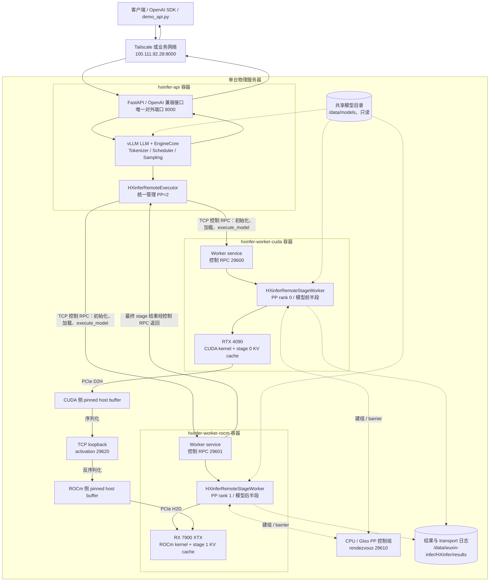
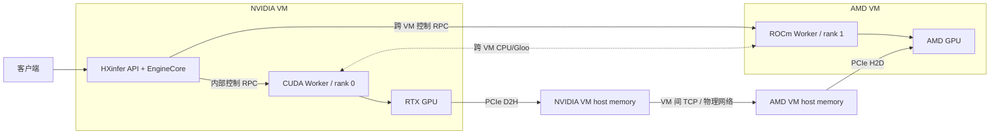

# HXinfer NVIDIA + AMD 单机异构 PP 验证报告

## 1. 验证目标

本次实验验证一个 vLLM EngineCore 能否统一管理两个独立启动、运行在不同软件栈中的 Pipeline Parallel Worker：

- PP rank 0：NVIDIA GeForce RTX 4090，CUDA vLLM 镜像；
- PP rank 1：AMD Radeon RX 7900 XTX，ROCm vLLM 镜像；
- PP=2，TP=1；
- Worker 控制面使用 TCP RPC 和 CPU/Gloo；
- stage activation 使用 TCP + pinned host memory；
- 两个 Worker 位于同一宿主机的两个 Docker 容器中。

实验同时检查共享模型目录、FP8 模型适配性、普通问答、短题正确率和 activation 传输记录。

## 2. 环境与存储

### 2.1 宿主机

| 项目 | 配置 |
|---|---|
| 操作系统 | Ubuntu 24.04.4 LTS |
| 内核 | 7.0.0-30-generic |
| NVIDIA GPU | GeForce RTX 4090，24 GiB，PCI `3b:00.0`，NUMA 0 |
| AMD GPU | Radeon RX 7900 XTX / Navi 31，约 20 GiB，PCI `b1:00.0`，NUMA 1 |
| PCIe | 两卡最大链路均为 16 GT/s ×16；两卡位于不同 NUMA 节点 |
| Docker | 29.7.2 |

两卡没有 NVLink，也没有经过验证的跨厂商 GPU P2P。activation 使用 GPU→host→GPU 路径，因此两次 GPU/host 搬运经过 PCIe；两卡跨 NUMA 还可能经过 CPU socket 间互联。

### 2.2 vLLM 镜像

| Worker | 镜像 | vLLM | PyTorch/运行时 |
|---|---|---:|---|
| NVIDIA rank 0 | `vllm/vllm-openai:latest` | 0.27.1 | PyTorch 2.13.0+cu130，CUDA 13.0 |
| AMD rank 1 | `vllm/vllm-openai-rocm:latest` | 0.27.1 | PyTorch 2.11.0，HIP 7.2 |

两套镜像的 GPU tensor smoke 均通过；CUDA 与 ROCm 镜像间的 CPU/Gloo `all_reduce` 实测得到一致结果 3。

实验镜像不是基于项目 Dockerfile 自行构建的镜像，而是测试时在服务器上拉取并使用的 vLLM 官方镜像。容器保存的 immutable image ID、上游创建时间和 digest 如下：

| 运行时 | Image ID | 上游镜像创建时间（UTC） | Repo digest |
|---|---|---|---|
| CUDA | `sha256:0a51ea5b4ae2dc5d81890e5173f54203d2a3ae0cfffe51b8fd2afd4391bfd967` | 2026-08-11 09:20:43 | `vllm/vllm-openai@sha256:0a51ea5b4ae2dc5d81890e5173f54203d2a3ae0cfffe51b8fd2afd4391bfd967` |
| ROCm | `sha256:bb44b39aea26798cce43030a98bf48efd0322ca7147367db86e38b96bd80f0e7` | 2026-08-11 09:15:57 | `vllm/vllm-openai-rocm@sha256:bb44b39aea26798cce43030a98bf48efd0322ca7147367db86e38b96bd80f0e7` |

CUDA、ROCm Worker 容器创建于 2026-08-25 05:35 UTC，API 容器创建于 05:37 UTC。PyTorch、CUDA、HIP 版本均是在容器内实际导入并采集的运行时版本，不是根据 tag 推测。`latest` 是可变 tag；若需要长期复现，应在配置中使用完整 digest，而不是继续依赖 `latest`。

### 2.3 数据盘布局

```text
/home/wuxin-infer/data   -> /data/wuxin-infer/
/home/wuxin-infer/models -> /data/models/

/data/wuxin-infer/HXinfer/                  # 源码、文档、结果、缓存
/data/models/Qwen3.8-27B-FP8/               # 已有共享 FP8 模型
/data/models/Qwen2.5-3B-Instruct/            # 公开 BF16 验证模型
```

未把模型权重或编译缓存写入容量较小的 home 文件系统。容器内统一只读挂载 `/data/models` 为 `/models`，结果和 Triton/Inductor 缓存写入 `/data/wuxin-infer/HXinfer/results`。

## 3. HXinfer 架构与代码改造

### 3.1 完整运行架构

本次验证使用三个容器，不是两个 Worker 共用一个容器：

| 容器 | 内部主要组件 | 职责 | 是否暴露模型 API |
|---|---|---|---|
| `hxinfer-api` | FastAPI/Uvicorn、vLLM `LLM`、EngineCore、Scheduler、Tokenizer、`HXinferRemoteExecutor` | 接收请求、统一调度、调用 Worker、返回 OpenAI 格式结果 | 是，端口 8000 |
| `hxinfer-worker-cuda` | Worker service、PP rank 0、CUDA vLLM、模型前半段和本 stage KV cache | 在 RTX 4090 执行第一段模型 | 否，仅内部 RPC 29600 |
| `hxinfer-worker-rocm` | Worker service、PP rank 1、ROCm vLLM、模型后半段和本 stage KV cache | 在 RX 7900 XTX 执行第二段模型 | 否，仅内部 RPC 29601 |

容器是隔离和部署边界，不等同于“每个容器只有一个进程”。`hxinfer-api` 内有 API server 进程及 vLLM 创建的 EngineCore 子进程；两个 Worker 容器各自拥有独立的 Python/vLLM runtime。三个容器通过 host network 通信，共享只读模型目录，但不共享 GPU 显存或 Python 地址空间。



一次请求的执行顺序为：

1. 客户端只调用 `hxinfer-api:8000`；
2. EngineCore 完成分词、调度和本轮执行计划；
3. `HXinferRemoteExecutor` 通过控制 RPC 驱动两个 Worker；
4. rank 0 在 RTX 4090 执行模型前半段；
5. 中间 activation 经 `CUDA GPU -> PCIe -> host -> TCP -> host -> PCIe -> AMD GPU` 传到 rank 1；
6. rank 1 在 RX 7900 XTX 执行模型后半段，最终结果返回 EngineCore；
7. EngineCore 继续 decode，直至停止条件满足，API 返回 OpenAI 格式响应。

迁移到两个 VM 后，逻辑架构不变，只改变部署位置和地址：



其中 PCIe 只负责每个 VM 内部的 GPU/host 搬运，两个 VM 之间仍由 TCP 和底层物理网络传输。需要把实验中的 `127.0.0.1` 改成 VM 可达地址，并放通控制 RPC、Gloo rendezvous 和 activation 端口；客户端仍然只访问 API 地址。

### 3.2 上层控制器

`external_pp.remote.executor.HXinferRemoteExecutor` 作为 vLLM 自定义 distributed executor：

1. 要求 PP=2、TP=1；
2. 从 `HXINFER_WORKER_ENDPOINTS` 读取两个独立 Worker 的控制地址；
3. 通过 TCP RPC 并行调用两个 Worker 的 `init_worker`、`init_device`、`load_model`；
4. 每一步调度都把 `execute_model` 发给两个 stage；
5. 从最后一个 stage 获取 `sample_tokens` 和模型输出；
6. EngineCore 退出时通知两个 Worker 释放模型和通信资源。

Controller 保留 vLLM 的 tokenizer、scheduler、KV cache 规划和采样流程，没有启动第二套独立 scheduler，也没有修改 vLLM 源码。

### 3.3 独立 Worker 服务

`external_pp.remote.worker_service` 在每个容器中独立启动 `WorkerWrapperBase`，监听一个控制端口：

```text
rank 0 control: 127.0.0.1:29600
rank 1 control: 127.0.0.1:29601
Gloo rendezvous: tcp://127.0.0.1:29610
activation data: 127.0.0.1:29620
```

两个 Worker 是两个独立 OS 进程和两个独立 vLLM runtime。Controller 连接已有 Worker，而不是使用 vLLM multiprocessing executor fork 出同一环境的子进程。

### 3.4 分布式控制面改造

`HXinferRemoteStageWorker.init_device()` 对初始化过程做最小替换：

- 把默认设备通信 backend 改为 CPU/Gloo，使 CUDA PyTorch 与 ROCm PyTorch 具有共同控制后端；
- PP group 设置 `use_device_communicator=False`，避免创建 NCCL/RCCL 的跨厂商设备 communicator；
- 禁用 custom all-reduce；
- stage-local 模型计算仍使用各自 GPU 的原生 CUDA/ROCm backend。

Gloo 只承担 rank 建组、barrier 等控制语义，不承担 activation payload。

### 3.5 activation 数据面改造

vLLM 原有 `pp_group.isend_tensor_dict` 和 `irecv_tensor_dict` 被绑定到 `TcpSocketPPTransport`：

```text
NVIDIA GPU tensor
  -> contiguous tensor
  -> CUDA D2H 到 pinned host tensor（PCIe）
  -> torch.save 序列化
  -> persistent TCP socket / loopback
  -> torch.load 到 CPU tensor
  -> pinned host tensor
  -> ROCm H2D（PCIe）
  -> AMD GPU tensor
```

这里的 TCP 传输的是完整 activation payload，不是显存地址，也不只是少量控制信息。rank 0 将 `IntermediateTensors` mapping 中的 `hidden_states`、`residual` 等 tensor 完整复制到 host，使用 `torch.save` 序列化为字节流，再发送：

```text
8-byte payload length + 完整 torch.save payload
```

rank 1 按长度读取全部 payload，使用 `torch.load` 恢复 CPU tensor，然后复制到 AMD GPU。日志中的 `bytes` 是完整序列化 payload 大小，不包括 8-byte 长度字段和 TCP/IP 包头。模型参数不随请求重复传输；模型权重在启动时由两个 Worker 分别从共享模型目录加载。

以下链路彼此独立，不能把它们都称为 Gloo 或控制信息：

| 链路 | 内容 |
|---|---|
| Controller → Worker 控制 RPC | 方法名、参数、调度请求和结果 |
| Worker 间 CPU/Gloo | 建组、barrier 等分布式控制语义 |
| rank 0 → rank 1 activation TCP | 完整中间 tensor payload |

TCP 使用 8 字节网络序 payload 长度、持久连接和 `TCP_NODELAY`。每条消息记录：

- payload 字节数；
- D2H 时间；
- socket 时间；
- H2D 时间；
- 总时间、sequence 和 tensor key。

当前实现不是直接 NVIDIA→AMD GPU P2P。两个进程虽然位于同一宿主机，但拥有不同虚拟地址空间；TCP loopback 负责进程间 payload 交接。后续单机优化可以用共享 pinned-memory ring 替换 TCP payload，TCP/Unix socket 仅保留控制和 sequence 通知。

### 3.6 测试脚本改造

本次补充：

- `qa_vllm.py`：支持 `--language-model-only`、`--max-num-batched-tokens`、`--max-num-seqs`；
- `simple_qa_vllm.py`：支持 `--max-num-batched-tokens`、`--max-num-seqs`；
- `run_remote_pp_controller.sh`：可从环境变量传入上述参数。

`language_model_only` 用于跳过 Qwen3.5 的视觉模块；批次参数用于避免短上下文 smoke 使用 vLLM 默认 8192-token 性能探测。

## 4. Docker 容器与服务进程

### 4.1 概念边界

Docker 容器是运行环境和资源隔离边界，Python 进程才是执行 HXinfer 逻辑的主体：

| Docker 容器 | 容器内进程 | 进程职责 |
|---|---|---|
| CUDA 容器 | `external_pp.remote.worker_service --rank 0` | CUDA Worker、PP stage 0 |
| ROCm 容器 | `external_pp.remote.worker_service --rank 1` | ROCm Worker、PP stage 1 |
| API 容器 | `external_pp.api_server`，以及其 EngineCore 子进程 | HTTP API、Tokenizer、Scheduler、Executor |

实际实验为了简化生命周期，使用 `docker run IMAGE python ...`，即把服务进程直接设为容器 PID 1。下面为了区分概念，改写成“先启动只承载环境的容器，再使用 `docker exec` 启动服务进程”。两种方式的推理架构等价。

### 4.2 第一步：只启动 Docker 容器

先准备结果目录：

```bash
mkdir -p /data/wuxin-infer/HXinfer/results/tutorial-qwen25-3b
```

CUDA 运行环境容器：

```bash
docker run -d --name hxinfer-tutorial-cuda \
  --gpus device=0 --network host \
  -v /data/wuxin-infer/HXinfer:/workspace/HXinfer:ro \
  -v /data/models:/models:ro \
  -v /data/wuxin-infer/HXinfer/results/tutorial-qwen25-3b:/results \
  -e HOME=/tmp -e PYTHONPATH=/workspace/HXinfer \
  -e HXINFER_ACTIVATION_HOST=127.0.0.1 \
  -e HXINFER_ACTIVATION_PORT=29620 -e HXINFER_LOG_DIR=/results \
  --entrypoint /bin/bash vllm/vllm-openai:latest \
  -lc 'sleep infinity'
```

ROCm 运行环境容器：

```bash
docker run -d --name hxinfer-tutorial-rocm \
  --device=/dev/kfd --device=/dev/dri \
  --group-add 44 --group-add 992 \
  --security-opt seccomp=unconfined --network host \
  -v /data/wuxin-infer/HXinfer:/workspace/HXinfer:ro \
  -v /data/models:/models:ro \
  -v /data/wuxin-infer/HXinfer/results/tutorial-qwen25-3b:/results \
  -e HOME=/tmp -e PYTHONPATH=/workspace/HXinfer \
  -e HXINFER_ACTIVATION_HOST=127.0.0.1 \
  -e HXINFER_ACTIVATION_PORT=29620 -e HXINFER_LOG_DIR=/results \
  --entrypoint /bin/bash vllm/vllm-openai-rocm:latest \
  -lc 'sleep infinity'
```

API 运行环境容器：

```bash
docker run -d --name hxinfer-tutorial-api \
  --gpus device=0 --network host \
  -v /data/wuxin-infer/HXinfer:/workspace/HXinfer:ro \
  -v /data/models:/models:ro \
  -v /data/wuxin-infer/HXinfer/results/tutorial-qwen25-3b:/results \
  -e HOME=/tmp -e PYTHONPATH=/workspace/HXinfer \
  -e HXINFER_WORKER_ENDPOINTS=127.0.0.1:29600,127.0.0.1:29601 \
  -e HXINFER_DIST_INIT=tcp://127.0.0.1:29610 \
  -e HXINFER_LOG_DIR=/results -e VLLM_USE_FLASHINFER_SAMPLER=0 \
  --entrypoint /bin/bash vllm/vllm-openai:latest \
  -lc 'sleep infinity'
```

此时只有三个 `sleep infinity` 容器主进程，模型尚未加载，也没有 HXinfer 服务端口。

### 4.3 第二步：启动两个 Worker 进程

打开新的宿主机终端 A，先进入已经运行的 CUDA 容器。这一步仍然是 Docker 操作，没有启动 Worker：

```bash
docker exec -it hxinfer-tutorial-cuda /bin/bash
```

进入容器后，终端提示符会发生变化。此时执行纯 Python 命令，启动 CUDA rank 0 Worker 进程：

```bash
/usr/bin/python3 -m external_pp.remote.worker_service \
  --rank 0 --listen 127.0.0.1:29600 \
  2>&1 | tee -a /results/worker-cuda.log
```

打开宿主机终端 B，先进入 ROCm 容器：

```bash
docker exec -it hxinfer-tutorial-rocm /bin/bash
```

然后在 ROCm 容器终端内启动 rank 1 Worker 进程：

```bash
/usr/bin/python3 -m external_pp.remote.worker_service \
  --rank 1 --listen 127.0.0.1:29601 \
  2>&1 | tee -a /results/worker-rocm.log
```

两个终端应分别显示 `HXINFER_WORKER_READY rank=0` 和 `rank=1`。这两个 Python 进程以前台方式运行，终端需保持打开。

### 4.4 第三步：启动 HXinfer API 进程

打开宿主机终端 C，先进入已经运行的 API 容器。这一步没有启动 API：

```bash
docker exec -it hxinfer-tutorial-api /bin/bash
```

然后在 API 容器终端内执行纯 Python 服务命令：

```bash
/usr/bin/python3 -m external_pp.api_server \
  --model /models/Qwen2.5-3B-Instruct \
  --served-model-name Qwen2.5-3B-Instruct \
  --host 0.0.0.0 --port 8000 --api-key hxinfer-demo \
  --worker-cls external_pp.remote.worker.HXinferRemoteStageWorker \
  --distributed-executor-backend external_pp.remote.executor.HXinferRemoteExecutor \
  --pipeline-parallel-size 2 --tensor-parallel-size 1 \
  --max-model-len 512 --max-num-batched-tokens 512 --max-num-seqs 8 \
  --max-tokens 64 --gpu-memory-utilization 0.80 \
  2>&1 | tee -a /results/api-server.log
```

API Python 进程启动后通过 RPC 连接两个已存在的 Worker，并触发建组、模型分片加载、KV cache 初始化和 warmup。完整启动通常需要约 2 分钟。终端 C 需保持打开；按 `Ctrl-C` 会停止 API 进程，但容器本身仍然运行。

同机容器使用 `127.0.0.1` 和 host network。迁移到双 VM 时，进程角色不变，只需把地址替换为 VM 可达地址并开放控制 RPC、Gloo rendezvous 和 activation 端口。

## 5. 实验过程与结果

### 5.1 基础兼容性

| 项目 | 结果 |
|---|---|
| CUDA GPU tensor smoke | PASS |
| ROCm GPU tensor smoke | PASS |
| CUDA/ROCm 镜像间 CPU/Gloo all-reduce | PASS，rank 结果均为 3 |
| 两镜像导入 HXinfer Executor/Worker | PASS |
| Qwen3.5/Qwen2.5 PP 模型注册检查 | PASS |

### 5.2 Qwen3.8-27B-FP8

两个 stage 均成功加载了各自的 PP 权重：

| Stage | 权重显存 | 首轮加载时间 | 页缓存命中后的加载时间 |
|---|---:|---:|---:|
| RTX 4090 rank 0 | 13.88 GiB | 68.88 s | 5.75 s |
| RX 7900 XTX rank 1 | 16.68 GiB | 79.95 s | 15.49 s |

4090 完成 FP8 profile，并报告约 6.82 GiB 可用 KV cache。7900 XTX 在第一个 W8A8 block-FP8 Triton kernel 上生成了 source、TTIR、TTGIR 和约 2.5 MB LLVM IR，但超过 8 分钟仍未生成最终 HSACO；两次不同 batch 配置均复现。

ROCm 镜像内的 AITER 不能作为 gfx1100 备选。vLLM 0.27.1 的 `is_aiter_found_and_supported()` 要求 CDNA3 或更高，gfx1100 返回不支持。

结论：HXinfer 已把 27B FP8 模型切到两个异构 stage 并完成权重加载；阻塞点位于 RDNA3 的 block-FP8 kernel backend，不在 Worker RPC、Gloo 建组或 PP 切层。

### 5.3 Qwen2.5-3B-Instruct 单题 smoke

| 指标 | 结果 |
|---|---:|
| Controller/Worker 退出码 | 0 / 0 / 0 |
| rank 0 权重显存 | 3.19 GiB |
| rank 1 权重显存 | 3.19 GiB |
| rank 0 可用 KV cache | 15.43 GiB |
| rank 1 可用 KV cache | 12.43 GiB |
| Engine load | 129.63 s |
| 生成时间 | 0.223 s |
| 问题 | `1+1等于多少？` |
| 输出 | `2` |
| activation 消息 | 4 条，367,764 bytes |

### 5.4 六个正常问答

问题覆盖 PP/TP 区别、火车长度计算、Python 算法、无 NVLink PP、KV cache 和英文总结。

| 指标 | 结果 |
|---|---:|
| 问题数 | 6 |
| 总输出 tokens | 530 |
| Engine load | 123.07 s |
| 生成时间 | 7.95 s |
| activation 消息 | 101 |
| activation 总 payload | 6,648,217 bytes |
| 最大单条 payload | 1,599,269 bytes |
| rank 0 累计 D2H | 17.94 ms |
| rank 0 累计 socket `sendall` | 6.83 ms |

6 个问题均生成了连贯内容；5 个中文长回答达到 96-token 测试上限，英文回答以 EOS 正常结束。因此该轮用于验证持续 decode 和多请求 activation 传输，不把截断回答作为完整答案准确率结论。

### 5.5 八个自动判分短题

短题覆盖算术、常识、翻译、Python 表达式和数列：

| 指标 | 结果 |
|---|---:|
| 通过数 | 8/8 |
| Engine load | 127.08 s |
| 生成时间 | 2.77 s |
| activation 消息 | 8 |
| activation 总 payload | 2,070,824 bytes |
| 最大单条 payload | 1,378,085 bytes |
| rank 0 累计 D2H | 3.60 ms |
| rank 0 累计 socket `sendall` | 1.27 ms |
| Controller/Worker 退出码 | 0 / 0 / 0 |

结果文件：

```text
/data/wuxin-infer/HXinfer/results/heterogeneous-qwen25-3b-simple-qa/comparison.json
```

## 6. TCP loopback 与 PCIe 解释

本实验同时使用 TCP loopback 和 PCIe，两者作用不同：

- PCIe：NVIDIA D2H 与 AMD H2D；
- TCP loopback：两个隔离进程之间交接 host payload；
- Gloo/TCP：rank 建组和控制语义；
- 控制 RPC/TCP：Controller 调用两个 Worker。

TCP 数据面发送完整 activation。单题 smoke 的 4 条序列化 payload 合计 367,764 bytes，加上每条 8-byte 长度字段后，应用层至少发送 367,796 bytes，尚未计算 TCP/IP 包头。

两张卡的最大 PCIe 链路均为 16 GT/s ×16，即 PCIe 4.0 ×16。忽略系统中的其他瓶颈，其理论单向 payload 上限约为：

```text
16 GT/s × 16 lanes × (128/130 encoding) ÷ 8 ≈ 31.5 GB/s
```

根据已有 transport 日志计算出的软件阶段有效吞吐如下。吞吐统一使用十进制 GB/s：

| 统计范围 | 数据量 | 耗时 | `payload / time` | 相对 31.5 GB/s |
|---|---:|---:|---:|---:|
| 4 条消息累计 CUDA D2H 阶段 | 367,764 bytes | 1.063 ms | 0.346 GB/s | 约 1.10% |
| 4 条消息累计 sender `sendall` | 367,764 bytes | 0.473 ms | 0.777 GB/s | 约 2.47% |
| 4 条消息累计 ROCm H2D 阶段 | 367,764 bytes | 10.101 ms | 0.036 GB/s | 约 0.12% |
| 最大单条消息 CUDA D2H | 329,509 bytes | 0.185 ms | 1.78 GB/s | 约 5.66% |
| 最大单条消息 sender `sendall` | 329,509 bytes | 0.194 ms | 1.70 GB/s | 约 5.40% |
| 最大单条消息 ROCm H2D 阶段 | 329,509 bytes | 6.907 ms | 0.0477 GB/s | 约 0.15% |

这些数值不是裸 PCIe 或 TCP loopback 带宽。当前计时混入了以下软件开销：

- tensor `contiguous`、pinned buffer 创建和 stream synchronize；
- `torch.save` / `torch.load` 序列化与反序列化；
- ROCm 接收侧额外的普通 CPU tensor → pinned tensor copy；
- Python 调度、socket kernel buffer copy 和小消息固定开销。

接收侧 `socket_ns` 还包含等待生产者开始发送的阻塞时间，因此不能用来计算网络带宽；现有日志也没有统一记录“rank 0 开始 D2H”到“rank 1 完成 H2D”的绝对端到端区间。因此当前可以得出两个结论：第一，传输完整 activation；第二，当前 Python 小消息路径远未利用 PCIe 4.0 ×16 的理论带宽。不能据此断言 PCIe 链路本身只有 0.04–1.8 GB/s。

严格的端到端性能实验还应增加 raw tensor bytes、serialize/deserialize、buffer allocation、D2H、wire、H2D 的独立时间戳，并分别运行 NVIDIA/AMD 的纯 D2H/H2D baseline。以上 activation 结果全部来自已保存的原始异构推理日志。

上述表格可以从原始日志复算：

```bash
python scripts/analyze_transport.py \
  results/heterogeneous-qwen25-3b-smoke/transport-rank0.jsonl \
  results/heterogeneous-qwen25-3b-smoke/transport-rank1.jsonl
```

### 6.1 大消息 TCP loopback 微基准

为单独回答“同宿主机 TCP 是否很慢”，2026 年 8 月 26 日在目标服务器上补充了不占用 GPU 的大消息微基准。测试使用两个独立 Python 进程和一条持续存在的 `127.0.0.1` TCP 连接；发送进程写入 8-byte 长度字段和预分配 payload，接收进程完整读取 payload 后才返回 ACK。发送端从开始发送到收到 ACK 的时间因此覆盖了消息进入接收进程的完整过程，而不只是数据写入发送端 socket buffer。

该测试不包含 `torch.save` / `torch.load`、CUDA D2H 或 ROCm H2D，只测量 host 侧 TCP loopback、内核 socket buffer copy、跨进程交接及 Python 调度的组合能力。测试时 HXinfer 和 GPU 容器均未启动，并使用 `nice -n 15` 降低测试对服务器其他任务的影响。每种消息大小先预热 3 次，再复用同一 TCP 连接执行测量：

```bash
cd /data/wuxin-infer/HXinfer
nice -n 15 python3 scripts/benchmark_tcp_loopback.py \
  --case 1:128 --case 16:32 --case 64:16 --warmups 3
```

| 单条消息 | 测量次数 | 总 payload | 聚合吞吐 | p50 延迟 / 吞吐 | p95 延迟 / 吞吐 |
|---:|---:|---:|---:|---:|---:|
| 1 MiB | 128 | 0.125 GiB | 3.518 GB/s | 0.266 ms / 3.935 GB/s | 0.538 ms / 1.948 GB/s |
| 16 MiB | 32 | 0.500 GiB | 4.639 GB/s | 3.612 ms / 4.645 GB/s | 3.650 ms / 4.597 GB/s |
| 64 MiB | 16 | 1.000 GiB | 4.685 GB/s | 14.324 ms / 4.685 GB/s | 14.618 ms / 4.591 GB/s |

64 MiB 消息的聚合吞吐为 4.685 GB/s，即约 37.48 Gbit/s；即使按 p95 延迟计算，仍为 4.591 GB/s，即约 36.73 Gbit/s。因此，目标服务器上的单流 TCP loopback 并非只有几百 MB/s，大消息稳定区间约为 4.6–4.7 GB/s。它约等于 PCIe 4.0 ×16 理论单向 payload 带宽 31.5 GB/s 的 14.9%，所以 TCP loopback 相对 PCIe 理论上限仍然较慢；如果序列化和 GPU 拷贝均被充分优化，它将可能成为新的瓶颈。

该结果与前表中的 activation `sendall` 数值不能直接等同：微基准计时直到接收进程完整读取并返回 ACK，而旧日志中的 `sendall` 只表示发送调用返回；另一方面，当前推理中的 activation 多数远小于 1 MiB，固定调度、序列化和 buffer 分配开销占比更高。大消息结果说明“原始 loopback TCP 能力不是当前 0.33 MiB activation 路径的首要问题”，并不代表 HXinfer 端到端已经达到 4.685 GB/s。

原始结果保存在：

```text
/data/wuxin-infer/HXinfer/results/tcp-loopback-large/result.txt
```

当前数据面还有 `torch.save`、`torch.load`、逐消息 pinned buffer 分配和内核 socket buffer copy。单机性能版本应改为预分配共享 pinned-memory ring；双 VM 默认不能共享同一虚拟内存，仍可使用当前 TCP 路径，或者额外评估 ivshmem/共享 hugepage。

## 7. 单一 API 封装与验证

### 7.1 对外使用方式

在两个 Worker 服务之上增加 `external_pp/api_server.py`，对外只暴露一个 OpenAI 兼容 HTTP 服务。调用关系如下：

```text
OpenAI client
    -> HXinfer API（唯一公网/Tailscale 入口）
    -> vLLM LLM / EngineCore / Scheduler
    -> HXinferRemoteExecutor
       -> rank 0 CUDA Worker
       -> rank 1 ROCm Worker
    -> activation: CUDA D2H -> TCP -> ROCm H2D
```

两个 Worker 只提供内部控制 RPC 和 activation 端口，不各自暴露模型 API，也不各自维护一套 scheduler。API 进程负责 tokenizer、请求调度、采样和 OpenAI 响应格式；因此实际客户端只需要配置一个 `base_url` 和 API key。容器或 VM 的数量不会改变这一使用接口。

当前入口支持：

- `GET /health`；
- `GET /v1/models`；
- `POST /v1/chat/completions`；
- `POST /v1/completions`；
- Bearer API key；
- `temperature`、`top_p`、`max_tokens`、`seed` 和 `stop`。

当前原型明确不支持 `stream=true`，收到流式请求时返回 HTTP 400；请求由一个锁串行进入同步 `vllm.LLM`。这是演示封装，不等同于 vLLM 原生异步 API server 的完整并发、流式、指标和工具调用能力。

### 7.2 启动方式

API 的 Docker 环境与 API Python 进程应分开理解：

1. 使用第 4.2 节的 `docker run ... sleep infinity` 创建并启动 API 容器；
2. 在宿主机执行 `docker exec -it hxinfer-tutorial-api /bin/bash`，只进入容器；
3. 在容器终端内执行 `/usr/bin/python3 -m external_pp.api_server ...`，启动 API 进程；
4. API 进程内部再创建 EngineCore 子进程。

API 不是第三个 PP Worker。PP world 仍然只有 CUDA rank 0 和 ROCm rank 1；API 容器负责上层调度和 HTTP 接口。

通用启动脚本为 `scripts/run_remote_pp_api.sh`；`scripts/demo_api.py` 提供健康检查加 Chat 请求的一键客户端，且只依赖 Python 标准库。生产环境应通过 `HXINFER_API_KEY` 注入独立密钥，不应沿用实验值。

### 7.3 HTTP 实测结果

测试时三个容器 `hxinfer-api`、`hxinfer-worker-cuda` 和 `hxinfer-worker-rocm` 同时存活。API 完成模型加载后监听 `0.0.0.0:8000`。

| 请求 | 结果 | 服务端本机耗时 |
|---|---|---:|
| `/health` | HTTP 200 | 0.0047 s |
| `/v1/models`，无 key | HTTP 401 | 0.0038 s |
| `/v1/models`，有效 key | HTTP 200 | 0.0022 s |
| Chat：`6×7` | HTTP 200，输出 `42` | 0.311 s |
| Chat：两句话解释 PP | HTTP 200，输出连贯中文回答 | 2.459 s |
| Completion：中国首都 | HTTP 200，输出包含“北京” | 0.590 s |
| Chat，`stream=true` | HTTP 400，明确提示原型未实现流式 | 0.0022 s |

另从开发机通过 Tailscale 地址调用该服务：健康检查 HTTP 200、0.614 s；完整 Chat `9+8` 返回 `17`、HTTP 200、2.667 s。一键客户端随后再次完成健康检查，Chat `12×3` 返回 `36`。这验证了客户端可以跨主机只访问一个 API 地址。

本轮 API 请求后，rank 0 和 rank 1 的 Worker RPC 序号同步推进至 166；两个日志均记录同序号的 `execute_model`，说明结果不是 API 层静态返回，而是实际经过两个异构 stage。transport 记录累计 55 条 activation、1,738,995 bytes，rank 0 累计 D2H 7.790 ms、socket `sendall` 3.371 ms。

证据目录：

```text
/data/wuxin-infer/HXinfer/results/heterogeneous-qwen25-3b-api/
```

### 7.4 双 GPU 现场验证方法

为了让一次短请求不被低频监控采样漏掉，现场验证使用两个终端。终端 A 持续刷新三个容器、两张 GPU 的利用率和显存：

```bash
cd /data/wuxin-infer/HXinfer
bash scripts/watch_heterogeneous_gpus.sh 0.5
```

终端 B 连续发送三次较长生成请求：

```bash
cd /data/wuxin-infer/HXinfer
HXINFER_API_BASE=http://100.111.92.28:8000 \
HXINFER_API_KEY=hxinfer-demo \
python scripts/demo_api.py \
  --prompt '请从1数到200，数字之间使用逗号分隔，不要省略。' \
  --max-tokens 256 --repeat 3 --timeout 60
```

监控中可看到 NVIDIA 和 AMD 显存已分配，并在请求期间观察利用率。因为两个 PP stage 串行执行且单步 kernel 很短，瞬时利用率不一定同时升高；GPU 利用率只能作为动态现象，不能单独证明同一个请求经过两张卡。

请求完成后使用同步 RPC 日志作为确定性证据：

```bash
docker logs --since 2m hxinfer-worker-cuda 2>&1 \
  | grep 'execute_model' | tail -n 10
docker logs --since 2m hxinfer-worker-rocm 2>&1 \
  | grep 'execute_model' | tail -n 10
```

两个 Worker 应出现相同 RPC id 的 `execute_model ok=true`。同时，`results/heterogeneous-qwen25-3b-api/transport-rank0.jsonl` 与 `transport-rank1.jsonl` 行数增长，分别记录 activation 的发送与接收。GPU 显存、同步 RPC id 和成对 transport 记录共同构成两个 stage 均参与推理的证据。

## 8. 结论与后续工作

本次实验已经实证：

1. 一个 vLLM EngineCore 可以管理两个独立容器中的 CUDA/ROCm Worker；
2. 两个 Worker 能用 CPU/Gloo 建立共同 PP world；
3. Qwen2.5-3B 在 RTX 4090 + RX 7900 XTX 上完成 PP=2 的加载、KV cache、prefill、连续 greedy decode 和正常退出；
4. activation 确实通过 PCIe D2H/H2D，并由 TCP loopback 完成跨进程 host 侧交接；
5. 当前 27B block-FP8 权重的阻塞点是 gfx1100 kernel backend，而不是 HXinfer 通信架构。

后续优先级：

1. 增加共享 pinned-memory ring 后端，对比 TCP loopback；
2. 复用同一协议验证双 VM 地址和防火墙配置；
3. 为 RPC 和 activation 增加版本握手、timeout、重连、sequence gap 检查；
4. 用适配 RDNA3 的 BF16/FP16 或受支持量化模型做更大规模性能测试；
5. 若必须使用 27B block-FP8，改用受 vLLM/AITER 支持的 CDNA GPU，或补齐并验证 gfx1100 kernel 实现。

## 9. 证据路径

```text
/data/wuxin-infer/HXinfer/results/heterogeneous-qwen35-27b-smoke/
/data/wuxin-infer/HXinfer/results/heterogeneous-qwen25-3b-smoke/
/data/wuxin-infer/HXinfer/results/heterogeneous-qwen25-3b-qa/
/data/wuxin-infer/HXinfer/results/heterogeneous-qwen25-3b-simple-qa/
/data/wuxin-infer/HXinfer/results/heterogeneous-qwen25-3b-api/
/data/wuxin-infer/HXinfer/results/tcp-loopback-large/
```

关键源码：

```text
external_pp/remote/executor.py
external_pp/remote/worker_service.py
external_pp/remote/worker.py
external_pp/remote/rpc.py
external_pp/transport/tcp_socket.py
scripts/qa_vllm.py
scripts/simple_qa_vllm.py
scripts/run_remote_pp_controller.sh
scripts/run_remote_pp_api.sh
scripts/demo_api.py
scripts/analyze_transport.py
scripts/benchmark_tcp_loopback.py
external_pp/api_server.py
```

## 10. 从零启动与测试教程

本节使用第 4 节中容器、进程分离的 `hxinfer-tutorial-*` 部署。命令均在服务器宿主机执行。

### 10.1 检查前置条件

```bash
cd /data/wuxin-infer/HXinfer

docker --version
nvidia-smi --query-gpu=name,memory.total --format=csv,noheader
/opt/rocm/bin/rocm-smi --showproductname

ls /data/models/Qwen2.5-3B-Instruct/config.json
docker image inspect vllm/vllm-openai:latest >/dev/null
docker image inspect vllm/vllm-openai-rocm:latest >/dev/null
```

确认 8000、29600、29601、29610、29620 没有被其他服务使用：

```bash
ss -ltn | grep -E ':(8000|29600|29601|29610|29620) ' || true
```

没有输出表示这些端口空闲。如果已有同名 tutorial 容器，先用 `docker ps -a --filter name=hxinfer-tutorial` 查看，不要直接删除来源不明的容器。

### 10.2 启动三个 Docker 环境

依次复制执行第 4.2 节的三个 `docker run` 命令，然后确认：

```bash
docker ps --filter name=hxinfer-tutorial \
  --format 'table {{.Names}}\t{{.Status}}'
```

预期看到：

```text
hxinfer-tutorial-cuda    Up
hxinfer-tutorial-rocm    Up
hxinfer-tutorial-api     Up
```

此时只是容器环境正常，尚未启动 Worker 和 API 进程。

### 10.3 启动两个 Worker 进程

准备两个新的 SSH 终端，严格按照第 4.3 节操作：每个终端先用 `docker exec -it ... /bin/bash` 进入一个 Worker 容器，再在容器内部运行对应的 Python 命令。不要关闭这两个终端。

两个终端分别出现 READY 后，可以在第三个宿主机终端检查日志文件：

```bash
grep 'HXINFER_WORKER_READY' \
  results/tutorial-qwen25-3b/worker-cuda.log \
  results/tutorial-qwen25-3b/worker-rocm.log
```

预期同时看到 rank 0 和 rank 1 READY。

### 10.4 启动 API 进程

准备第三个新的 SSH 终端，按照第 4.4 节先进入 API 容器，再在容器内执行纯 Python API 命令。API 日志会直接显示在当前终端，同时写入 `/results/api-server.log`。

首次启动会加载两个 stage 的模型并创建 KV cache，约需 2 分钟。等待当前终端出现：

```text
Uvicorn running on http://0.0.0.0:8000
```

不要在这个终端按 `Ctrl-C`，否则会停止 API。另开第四个 SSH 终端执行后续检查和问答。

### 10.5 检查 API 并发送问题

健康检查：

```bash
curl -sS http://127.0.0.1:8000/health
```

预期：

```json
{"status":"ok"}
```

发送一次问答：

```bash
HXINFER_API_BASE=http://127.0.0.1:8000 \
HXINFER_API_KEY=hxinfer-demo \
python scripts/demo_api.py \
  --prompt '请只回答数字：12乘以3等于多少？'
```

预期回答包含：

```text
health: ok
request 1/1 assistant: 36
```

### 10.6 观察两张 GPU

另开一个 SSH 终端：

```bash
cd /data/wuxin-infer/HXinfer
HXINFER_API_CONTAINER=hxinfer-tutorial-api \
HXINFER_CUDA_CONTAINER=hxinfer-tutorial-cuda \
HXINFER_ROCM_CONTAINER=hxinfer-tutorial-rocm \
bash scripts/watch_heterogeneous_gpus.sh 0.5
```

原终端连续发送长请求：

```bash
HXINFER_API_BASE=http://127.0.0.1:8000 \
HXINFER_API_KEY=hxinfer-demo \
python scripts/demo_api.py \
  --prompt '请从1数到200，数字之间使用逗号分隔，不要省略。' \
  --max-tokens 256 --repeat 3 --timeout 60
```

### 10.7 验证两个 Worker 均参与执行

```bash
grep 'execute_model.*ok=true' \
  results/tutorial-qwen25-3b/worker-cuda.log | tail -n 10
grep 'execute_model.*ok=true' \
  results/tutorial-qwen25-3b/worker-rocm.log | tail -n 10

wc -l \
  results/tutorial-qwen25-3b/transport-rank0.jsonl \
  results/tutorial-qwen25-3b/transport-rank1.jsonl
```

两个日志应出现相同 RPC id，两个 transport 文件的行数应相等并随请求增加。

### 10.8 停止服务

停止三个 tutorial 容器会同时终止其中的 API、EngineCore 和 Worker 进程，但不会删除模型或结果：

```bash
docker stop \
  hxinfer-tutorial-api \
  hxinfer-tutorial-cuda \
  hxinfer-tutorial-rocm
```

下一次需要先 `docker start` 三个容器，再按照第 4.3、4.4 节重新进入容器并启动 Python 进程。
